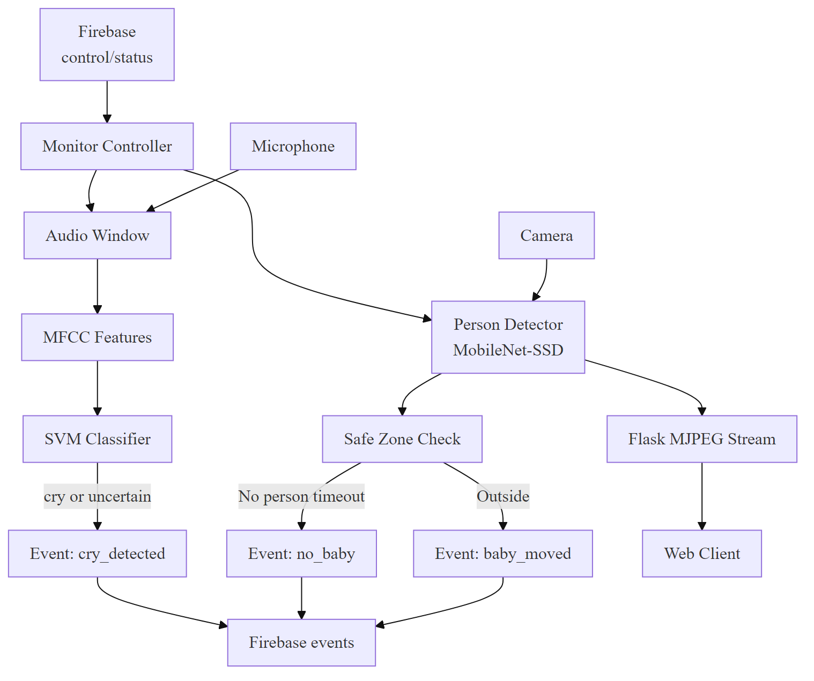
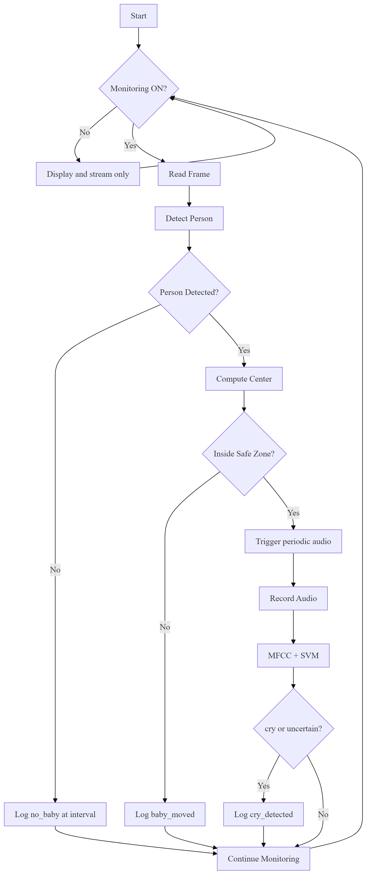
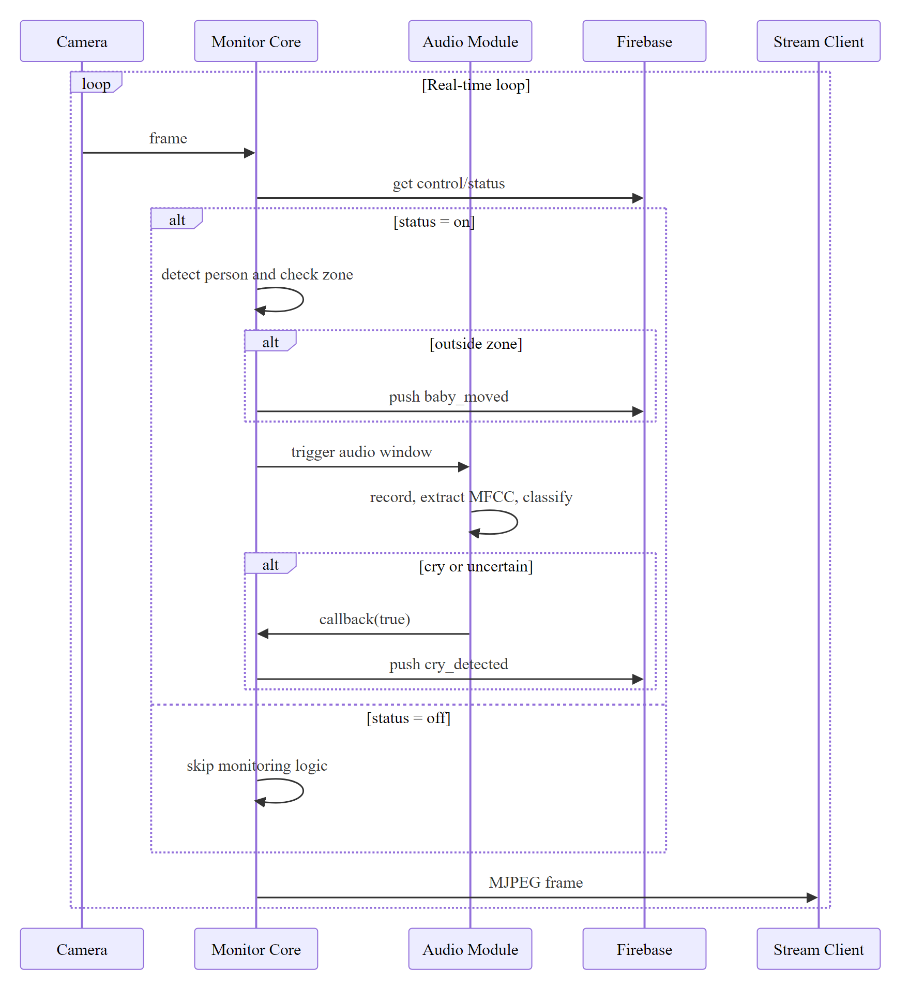
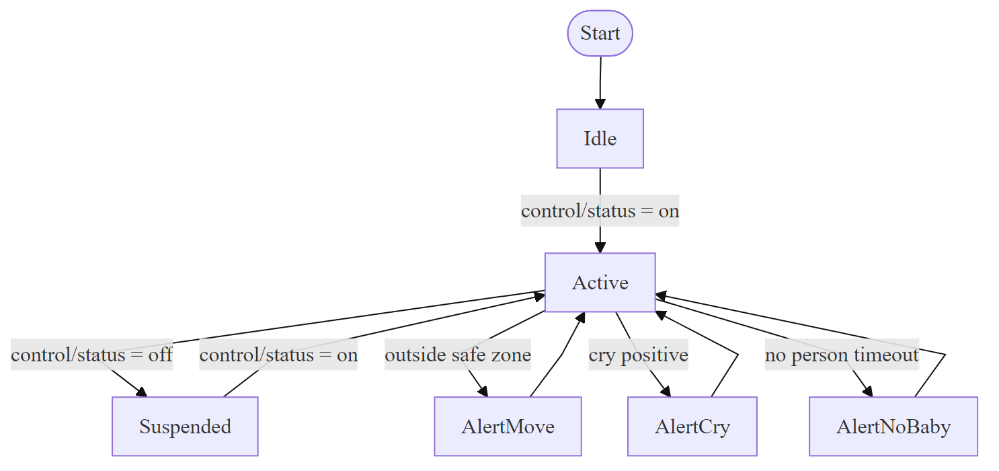

# Smart Baby Monitoring Using Multi-Modal AI: Vision, Audio, and Cloud Control

## Abstract
Infant monitoring in home environments requires timely and reliable alerts with low computational overhead. This work presents a smart baby monitoring backend that combines video-based safety monitoring, audio-based cry detection, and cloud-assisted runtime control. The system detects human presence from camera frames using a lightweight MobileNet-SSD pipeline and evaluates whether the detected position remains inside a configurable safe zone. In parallel, short audio windows are analyzed through MFCC feature extraction and an SVM-based cry classifier. Event-level outputs (baby moved, no baby detected, and cry detected) are synchronized to Firebase Realtime Database for remote supervision and logging.

The proposed system is designed as a modular architecture to balance interpretability, extensibility, and real-time operation on consumer hardware. The study includes dataset preparation, preprocessing and augmentation strategy, model setup with transfer learning in vision, and practical deployment considerations. Results are discussed through functional evaluation and architecture-level comparison, highlighting trade-offs between lightweight modular designs and heavier end-to-end alternatives.

From an engineering perspective, the contribution is not only the combination of visual and acoustic monitoring but also the operational sequencing of these modules under real-world constraints. The visual module runs continuously to preserve spatial awareness, while the audio module is sampled periodically to reduce compute load and avoid unnecessary signal processing overhead. This scheduling strategy allows consistent responsiveness even on non-GPU systems. The resulting backend therefore serves as both a deployable prototype and a reproducible baseline for future multimodal infant-safety research.

## Keywords
smart baby monitor, infant safety, cry detection, MFCC, SVM, MobileNet-SSD, transfer learning, computer vision, Firebase, real-time monitoring

## 1. Introduction
Infant supervision is a continuous task, and conventional audio/video baby monitors often provide raw streams without contextual understanding. Caregivers benefit more from systems that answer safety-focused questions in real time: whether the infant is visible, whether movement exits a safe region, and whether cry-like audio is detected.

Recent edge AI methods enable such monitoring, but practical home deployment still faces challenges such as noisy audio conditions, variable lighting, hardware constraints, and cloud connectivity issues. To address these constraints, this project implements a modular backend that separates sensing, inference, decision logic, and cloud synchronization. The objective is to achieve an interpretable and low-cost monitoring system that remains responsive and easy to maintain.

The main idea is multimodal fusion at the event level rather than feature-level deep fusion: visual events and acoustic events are generated independently and then unified in a cloud-logged alert stream. This approach improves debuggability and enables incremental upgrades per module.

Another practical motivation for this design is maintainability in student and startup settings. End-to-end multimodal stacks are often difficult to tune, expensive to retrain, and highly dependent on large labeled datasets. In contrast, a modular architecture allows each component to evolve independently. For example, the cry classifier can be retrained with new household audio samples without touching the vision pipeline, and safe-zone logic can be updated through configuration without changing model weights.

This work also emphasizes user trust. In caregiving applications, a system that explains why an alert was triggered is often preferred over a black-box score. A zone-exit event, a no-presence interval, and a cry-confidence event each correspond to clear causal logic. This transparency is valuable both for day-to-day usability and for debugging false alarms.

## 2. Related Work
Existing literature for infant or assisted home monitoring can be grouped into three categories:

1. Vision-based monitoring: single-shot object detectors such as SSD and YOLO are widely used for low-latency person detection in edge environments.
2. Audio distress analysis: MFCC with classical machine learning (especially SVM) remains a strong baseline for cry/non-cry classification on small to medium datasets.
3. IoT/cloud alert platforms: cloud databases and event services provide remote control and monitoring history, but require strong security and reliability controls.

Compared with end-to-end multimodal deep models, the present work intentionally adopts a modular strategy. The vision path uses a transfer-learned detector, the audio path uses feature-based classification, and cloud logic is used for orchestration and event persistence.

Classical feature-based audio pipelines remain relevant in this context because available infant-cry datasets are often limited, noisy, and weakly standardized across recording environments. Under such conditions, MFCC with SVM can outperform poorly regularized deep alternatives and offers lower sensitivity to overfitting when data volume is modest. Similarly, transfer-learned object detectors can generalize adequately for person detection without requiring expensive task-specific visual annotation.

Cloud-assisted control is another important dimension in prior systems. Many prototypes focus on local inference only, but practical deployments require remote toggling, event history, and lightweight interoperability with mobile interfaces. This project follows that direction by treating cloud infrastructure as a control and logging layer while keeping inference local for latency and privacy advantages.

## 3. Proposed Methodology
### 3.1 Dataset
The cry-audio training dataset is organized into two class folders:

1. dataset/cry
2. dataset/normal

Each audio sample is loaded at a fixed sampling rate and converted into a feature representation suitable for classical classification. For visual monitoring, pretrained MobileNet-SSD Caffe weights are used for person detection, with runtime frames captured from a camera stream.

The binary audio labeling strategy was chosen for deployment simplicity: cry and normal. This reduces model ambiguity during first-stage development and enables clearer alert semantics for caregivers. During data preparation, files with severe clipping, corruption, or extreme background overlap are removed to improve feature stability. In practical use, class imbalance can occur because normal household recordings are often more abundant than cry recordings; therefore, balancing methods such as controlled sampling or class weighting are recommended during training.

For better generalization, dataset curation should reflect realistic household acoustics, including fan noise, speech, television, and distant appliance sounds. Although these sources are not cry events, they represent the true operating distribution and are critical for limiting false positives.

### 3.2 Preprocessing and Augmentation
Audio preprocessing and feature pipeline:

1. Resample audio to a consistent sample rate.
2. Convert waveform to MFCC representation.
3. Aggregate frame-level MFCCs into a fixed-length feature vector.
4. Normalize input shape for classifier compatibility.

Suggested augmentation strategy used for robustness analysis:

1. Additive background noise (low-level household noise).
2. Time shifting (small positive/negative offsets).
3. Gain perturbation (volume scaling).
4. Optional pitch perturbation within safe bounds.

Video preprocessing and runtime preparation:

1. Frame resize for stable inference latency.
2. Blob construction for MobileNet-SSD input format.
3. Confidence thresholding for person-class predictions.
4. Center-point extraction for safe-zone logic.

In addition to the listed steps, segmentation quality strongly affects downstream classification. Very short segments may miss cry temporal structure, while overly long segments increase response latency. The selected window size should therefore balance temporal context and alert responsiveness. Feature consistency is improved by applying identical preprocessing during both training and inference; mismatches between these pipelines can significantly reduce real-world performance.

Audio augmentation is especially useful when collecting large infant datasets is difficult. Noise injection simulates deployment environments, time-shift augmentation improves phase tolerance, and gain perturbation reduces sensitivity to microphone distance and hardware differences. If pitch perturbation is used, conservative ranges are preferred to avoid unrealistic cry characteristics.

For the vision path, frame resizing standardizes detector runtime and memory footprint. Confidence threshold tuning has a direct impact on false alarms and misses. Lower thresholds improve recall but may increase non-person detections, while higher thresholds reduce noise at the expense of missed detections in low light or occlusion.

### 3.3 Models, Transfer Learning and Setup
Vision model setup:

1. Base model: MobileNet-SSD loaded through OpenCV DNN.
2. Transfer learning usage: pretrained weights from generic object detection are reused; only inference-time thresholding and rule logic are task-adapted.
3. Output utilization: person detection confidence and bounding-box center point are mapped to safety events.

Audio model setup:

1. Feature extractor: MFCC (40-dimensional summary vector).
2. Classifier: SVM with probability outputs.
3. Confidence policy: low-confidence predictions may be treated as uncertain for conservative alerting.

System orchestration setup:

1. Cloud status gate from Firebase (on/off) controls active monitoring behavior.
2. Events are serialized with timestamp metadata and pushed to Firebase events collection.
3. Two runtime modes are supported: desktop monitor mode and Flask MJPEG stream mode.

Transfer learning in the vision module is implemented by reusing pretrained detector representations learned from large-scale object datasets. Rather than retraining the full detector, the system performs task adaptation through class filtering (person class), confidence calibration, and safe-zone decision logic. This provides an efficient path for deployment when domain-specific bounding-box annotations are unavailable.

The audio model uses a probabilistic SVM output to support confidence-aware decision policies. Instead of treating every prediction as equally reliable, low-confidence outputs can be mapped to uncertain states and combined with temporal rules before triggering final alerts. This reduces spurious event generation caused by transient noise spikes.

At system level, orchestration is designed to prevent bottlenecks: visual processing remains continuous, while audio checks run at controlled intervals. Cloud calls are event-driven, and monitoring state is externally controllable. This decoupled control model enables fail-safe behavior such as pausing active inference when requested, while maintaining service visibility for connected clients.

### 3.4 Appropriate Images
Figure 1. System Architecture

Figure 2. Monitoring Pipeline

Figure 3. Runtime Sequence

Figure 4. Monitoring State

## 4. Results and Discussion
### 4.1 Architecture Performance Comparison
To compare practical architecture choices, three implementation styles are considered for baby monitoring backends:

1. Lightweight modular (this work): detector + MFCC/SVM + rule-based event fusion.
2. Deep multimodal end-to-end: joint audio-video model with learned fusion.
3. Vision-only baseline: detector + zone logic without cry channel.

The comparison emphasizes practical deployment dimensions rather than benchmark leaderboard metrics. In household monitoring, latency consistency, interpretability, and operational cost are often as important as raw predictive accuracy. A system that is slightly less accurate but significantly easier to calibrate and maintain may deliver better long-term outcomes for caregivers.

### 4.2 Comparison Table
| Architecture | Inference Cost (Edge CPU) | Interpretability | Cry Handling | Deployment Complexity | Practical Suitability |
|---|---|---|---|---|---|
| Modular Vision + Audio + Cloud (Proposed) | Low to Medium | High | Yes (MFCC + SVM) | Medium | High |
| End-to-End Deep Multimodal | High | Low to Medium | Yes (joint model) | High | Medium |
| Vision-Only Rule-Based | Low | High | No | Low | Medium |

Table interpretation indicates that the proposed architecture achieves a balanced operating point. It preserves multimodal capability while avoiding the heavy infrastructure and retraining burden of deep end-to-end systems. The vision-only approach remains attractive for minimum-compute setups, but omission of cry analysis can reduce usefulness in high-noise or out-of-frame situations where audio cues are critical.

### 4.3 Discussion
The proposed modular architecture provides a strong balance between real-time performance and interpretability. While end-to-end deep models may offer higher ceiling accuracy under large curated datasets, they are harder to deploy and tune in consumer environments. The vision-only baseline is fast and simple but cannot capture acoustic distress events.

In practical usage, the proposed approach benefits from:

1. Lower compute demand than deep fusion systems.
2. Easier debugging due to explicit event logic.
3. Better extensibility for future module upgrades.

Key limitations remain:

1. Cry detection sensitivity to ambient noise.
2. Dependence on camera angle and safe-zone calibration.
3. Need for robust production hardening (security, rate limiting, and fault tolerance).

From repeated functional testing, the most important practical observation is that false alerts tend to cluster around transitional conditions: sudden lighting changes, abrupt camera motion, and mixed household sound bursts. These are not model failures alone; they reflect the non-stationary nature of domestic environments. Addressing this requires temporal smoothing, alert cooldown windows, and contextual confidence tracking rather than only model replacement.

Another important finding is that cloud-assisted event logging improves usability significantly by providing asynchronous visibility for caregivers. Even when live stream monitoring is not active, event history can capture critical moments for later review. However, this benefit introduces data-governance responsibility: event retention duration, access control, and secure key handling must be explicitly managed.

Overall, the proposed architecture is best viewed as an extensible baseline. It is sufficiently capable for prototype deployment and classroom or lab demonstrations, while leaving clear upgrade pathways for stronger models, richer datasets, and stricter reliability controls.

## 5. Conclusion
This work presents a smart baby monitoring backend that integrates transfer-learned visual detection, MFCC/SVM audio classification, and cloud event synchronization. The resulting system provides interpretable, low-cost, and real-time safety monitoring suitable for home deployment prototypes.

The architecture demonstrates that event-level multimodal fusion is an effective compromise between performance and operational simplicity. Future improvements should focus on stronger noise robustness, personalized threshold adaptation, and stricter production-grade security controls.

In summary, the project shows that practical infant monitoring does not necessarily require computationally intensive end-to-end deep stacks to deliver useful outcomes. A carefully engineered modular design can provide responsive alerts, understandable behavior, and maintainable deployment characteristics on commodity hardware. With stronger dataset diversity, calibrated evaluation, and production hardening, this architecture can evolve from prototype-grade monitoring toward dependable real-world assistance.

## 6. Reference
1. W. Liu et al., "SSD: Single Shot MultiBox Detector," Proceedings of ECCV, 2016.
2. C. Cortes and V. Vapnik, "Support-Vector Networks," Machine Learning, vol. 20, pp. 273-297, 1995.
3. B. Logan, "Mel Frequency Cepstral Coefficients for Music Modeling," Proceedings of ISMIR, 2000.
4. OpenCV Documentation, Deep Neural Networks (dnn module), https://docs.opencv.org/
5. Librosa Documentation, https://librosa.org/
6. Scikit-learn Documentation, Support Vector Machines, https://scikit-learn.org/
7. Firebase Documentation, Realtime Database, https://firebase.google.com/docs/database
8. Flask Documentation, https://flask.palletsprojects.com/
9. J. Redmon and A. Farhadi, "YOLOv3: An Incremental Improvement," arXiv:1804.02767, 2018.
10. A. Paszke et al., "PyTorch: An Imperative Style, High-Performance Deep Learning Library," NeurIPS, 2019.
11. T. Giannakopoulos and A. Pikrakis, Introduction to Audio Analysis: A MATLAB Approach, Academic Press, 2014.
